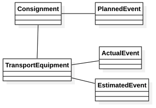
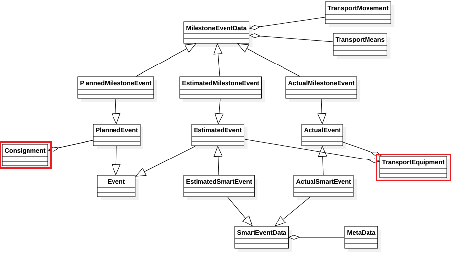
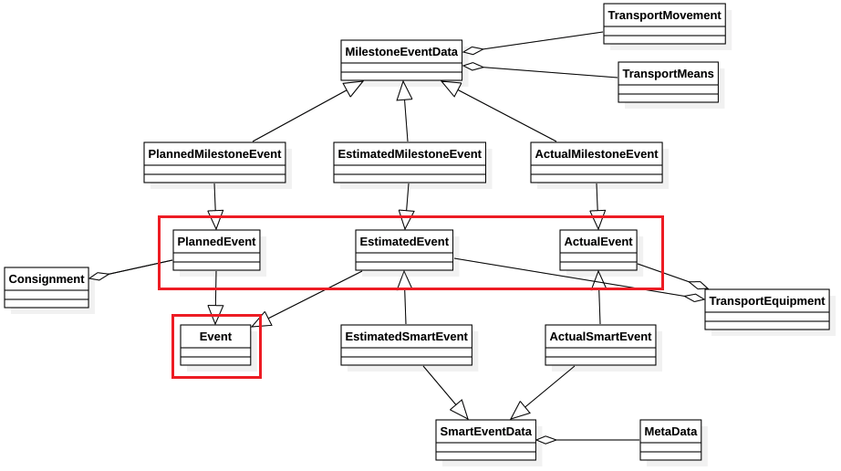
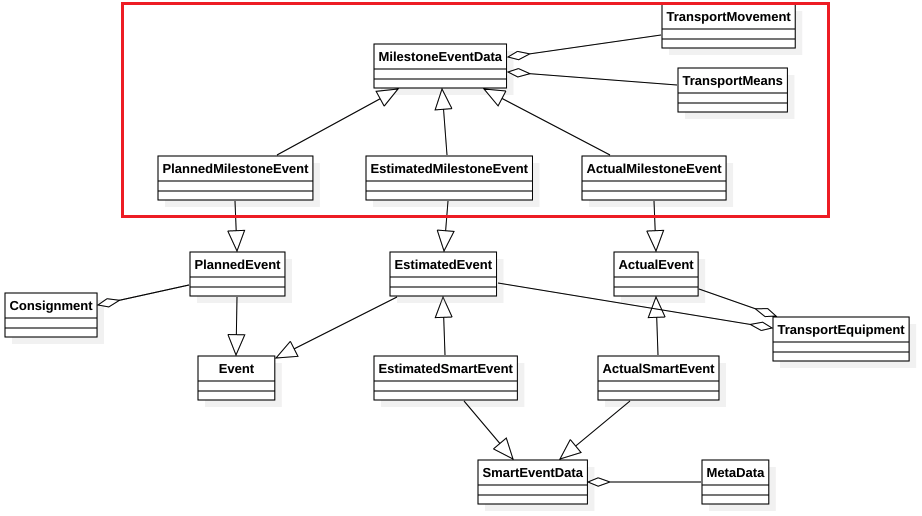
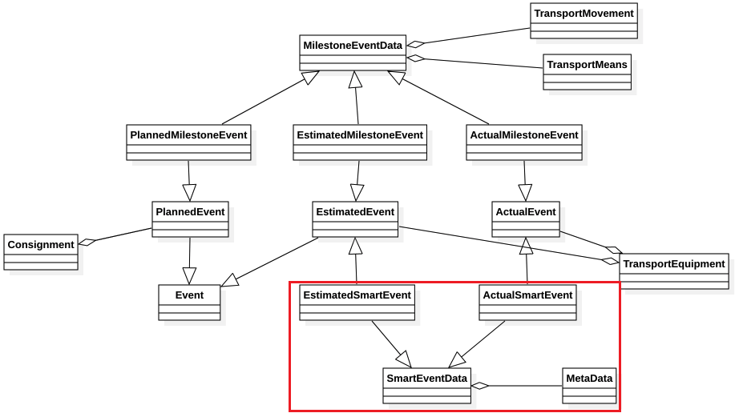

# OpenShipping.org Tracking API

The *Tracking API* provides querying functionality for getting shipping status, targeted answering common industry tracking requests. Data publishers include carriers and other shipping actors, as well as data aggregation service providers. Data consumers are mainly beneficiary cargo owners, shippers, consignees and similar customers with a need to track cargo movements. 

The corresponding OpenAPI .yaml file for the Tracking API can be found here: [tracking-api.yaml](tracking-api.yaml). The same is also on SwaggerHub here: [https://app.swaggerhub.com/apis/OpenShippingDotOrg/OpenShipping-TrackingAPI](https://app.swaggerhub.com/apis/OpenShippingDotOrg/OpenShipping-TrackingAPI).

## Background
The Tracking API was developed in continuation of the OpenShipping.org [Event API](https://github.com/OpenShipping/openshipping.github.io/tree/master/event-api). It is a natural continuation of the data model of the Event API, based on the exact same data model and event model, essentially just changed to serve request/reply (`GET`) tracking use cases instead of stateless event publishing (`POST`). While strongly related, they are individual stand alone APIs, serving quite different use cases. Thus, parts of the documentation is consciously repeated between these two specifications.

### UN/CEFACT Foundation

The Tracking API allows retrieving Consignments and Transport Equipment tracking statuses. These are direct implementations of the Consignment and Transport Equipment classes of the UN/CEFACT Supply Chain Reference Data Model (SCRDM)’s Buy-Ship-Pay model, which is to be considered the semantic reference model for this API. 

A *Consignment* represents the contracted movement of goods and the Transport Equipment used for that transport. From the perspective of common carrier business processes, the Consignment roughly represents the booking confirmation and/or a bill of lading (in cases where they differ). Please note that Consignment is to be distinguished from "shipment", which refers to the traded goods. These semantics are often a bit blurry, carriers traditionally have not have a reason to distinguish. Throughout the API semantics are adopted directly from the UN/CEFACT SCRDM Buy-Ship-Pay model, emphasizing this distinction between Trade Data (yellow) and Transport Data (blue). 

*Transport Equipment* in our context can be considered a container. Particularly, it represents the equipment matching, when a physically identified container has been assigned to the consignment.  The relation to a Consignment is important: since the same physical container is reused over and over, it is the Transport Equipment within a Consignment which is relevant to a given set of shipping parties. 

Shipment plays an important role, but has not yet been included in this first version of the API entirely due to scope confinement. The Shipment class represents the traded of goods inside the containers, and are of important relevance to authorities, financial institutions, sellers and sellers. It is worth noting that LCL tracking should be done through the Shipment class, so the current version of the API is only meant to deal with FCL. We consider adding the Shipment class a natural future extension of the API. 

Movement and Means are implemented in the Milestone events. Both are represented in the resource model, available through the Milestone event endpoints. 

### Additional Adopted Standards
* **UN/CEFACT Smart Container project under transports and logistics** for tracking and monitoring physical trip execution, implemented in the SmartEvent endpoints. 
* **UN/CEFACT Code List recommendation 24**, supported through the generic events. 
* **UN/Locode**, implemented at attribute level for geographical locations
* **SMDG**, implemented at attribute level for terminal identification
* **IMO**, implemented at attribute level vessel identification
* **ISO 8601**, implemented at attribute level for time and timezone representation
* **ISO 6346**, implemented at attribute level for container identification

## Resource Model
```
GET /consignments/{consignmentRef}
GET /transportEquipment/{equipmentNumber}
```
The Tracking API exposes two endpoints, representing the `Consignment` and `TransportEquipment` resources. Note that the Tracking API is intended to be used as resource reference in linked data contexts for Consignment and Transport Equipment. 

In the response to these requests is returned a list of various kinds of events, which come in three flavors: planned, estimated and actual. They are related in the following manner: 



By and large, the industry plans at the Consignment level (meaning the plan is the same for all containers), and very often the individual container cannot be identified until a while after the plan is issued. This is represented by *Planned Events*, which are thus bundled into a full Consignment transport plan. 

By contrast, *Actual Events* are physical occurrences of the individual, identified containers. A container is gated in, not a Consignment. Thus, Actual Events relate to Transport Equipment. 

The same is the case for *Estimated Events*, which are operational expected occurrences such as ETAs and ETDs. This is different from a plan: a delay may render a plan invalid, but it doesn't automatically update that plan to a new one. 

### Example TransportEquipment Responses
```
{
  "consignmentRef": "CMA32112",
  "equipmentNumber": "MRSU3395549",
  "milestoneEvents": [
    {
      "eventNature": "Estimated",
      "eventTime": "2018-08-02T06:08:20.000+05:00",
      "eventCodeDescription": "Estimated vessel departure",
      "vehicleId": 9356309,
      "vehicleType": "922W",
      "location": "USMOB",
      "terminal": "USMOB-APMT",
      "transportationPhase": "Import",
      "fullStatus": "Full"
    },
    {
      "eventNature": "Actual",
      "eventTime": "2018-06-22T06:20:30.000-04:00",
      "eventCodeDescription": "Actual vessel arrival",
      "vehicleId": 9356309,
      "vehicleType": "922W",
      "terminal": "MYTPP-PTP",
      "location": "MYTPP",
      "transportationPhase": "Export",
      "fullStatus": "Full"
    }
  ],
  "smartEvents": [
  ],
  "genericEvents": [
    {
      "eventNature": "Actual",
      "eventTime": "2018-06-29T06:10:30.000-04:00",
      "eventCodeType": "CEFACT Recommendation 24",
      "eventCodeValue": 359,
      "eventCodeDescription": "Bill of Lading issued",
      "gpsLocation": "55.702248, 12.600225"
    }
  ]
}
```

### Example Consignment Responses
```
{
  "consignmentRef": "CMA32112",
  "milestoneEvents": [
    {
      "eventNature": "Planned",
      "eventTime": "2018-08-03T06:20:00.000+05:00",
      "eventCodeDescription": "Planned vessel departure",
      "vehicleId": 9356309,
      "vehicleType": "922W",
      "location": "USMOB",
      "terminal": "USMOB-APMT",
      "transportationPhase": "Import",
      "fullStatus": "Full"
    },
    {
      "eventNature": "Planned",
      "eventTime": "2018-06-22T08:00:30.000-04:00",
      "eventCodeDescription": "Planned vessel arrival",
      "vehicleId": 9356309,
      "vehicleType": "922W",
      "terminal": "MYTPP-PTP",
      "location": "MYTPP",
      "transportationPhase": "Export",
      "fullStatus": "Full"
    }
  ],
  "genericEvents": [
  ],
  "transportEquipment": [
    {
	  "consignmentRef": "CMA32112",
	  "equipmentNumber": "MRSU3395549",
      "milestoneEvents": [
        {
	      "eventNature": "Estimated",
	      "eventTime": "2018-08-02T06:08:20.000+05:00",
	      "eventCodeDescription": "Estimated vessel departure",
	      "vehicleId": 9356309,
	      "vehicleType": "922W",
	      "location": "USMOB",
	      "terminal": "USMOB-APMT",
	      "transportationPhase": "Import",
	      "fullStatus": "Full"
	    },
	    {
	      "eventNature": "Actual",
	      "eventTime": "2018-06-22T06:20:30.000-04:00",
	      "eventCodeDescription": "Actual vessel arrival",
	      "vehicleId": 9356309,
	      "vehicleType": "922W",
	      "terminal": "MYTPP-PTP",
	      "location": "MYTPP",
	      "transportationPhase": "Export",
	      "fullStatus": "Full"
	    }
      ],
      "smartEvents": [
      ],
      "genericEvents": [
	    {
	      "eventNature": "Actual",
	      "eventTime": "2018-06-29T06:10:30.000-04:00",
	      "eventCodeType": "CEFACT Recommendation 24",
	      "eventCodeValue": 359,
	      "eventCodeDescription": "Bill of Lading issued",
	      "gpsLocation": "55.702248, 12.600225"
	    }
      ]
    }
  ]
}
```

## Event Model
The returned lists of events are further subdivided based on a logical model, which is introduced in this section. 

### Where Events Occur

* All Milestone events occur within a defined location (UNLOCODE location and SMDG Terminal). 
* Smart Events occur continuously along each leg (GPS Coordinates), between locations.
* Generic Events may not relate to any kind of location at all.

### Milestone Events

#### Milestone Event Introduction
The Milestone events are modular, and can model any Consignment’s multi-modal transport plan. This reflects the various locations which the Equipment needs to moving move between for contractual and operational purposes. 


Equipment is moved between locations by various means of transport. Such “legs” can be considered the edges connecting location nodes.  


Each leg are represented consistently as four distinct, key milestone events representing how containers are first *loaded*, then *departs* from one location, *arrives* at a different location, and is *discharged* from that means of transport. This cycle is repeated for each leg of the transport plan. 


Through the journey, the container changes status, from *export* to *import*, and *empty* to *full* and then again *empty*. These statuses are represented as attributes on the events. 


Finally, each event comes in three types: *planned*, representing how the carrier intends to carry out the transport, *estimated*, which can be signaled along the way (not shown below), and *actual*, when the milestone event has been carried out. 


#### Milestone Event Model

A transport plan Leg is described by four events: 
* Load
* Departure
* Arrival 
* Discharge

Each, in turn, come in three flavors: 
* Planned – what is supposed to happen
* Estimated – what and when events are expected to happen
* Actual – what has indeed happened

This results in 12 distinct events per leg type: 


Legs are joined together to form a full transport plan. Leg-joining happens at terminals.
 
Note that Planned events relate to Consignments, whereas Estimates and Actuals relate to Equipment. This reflects that carriers plans for the full consignment, but containers are in reality moved individually. 

There are individual events for each type of leg: 
* Truck 
* Rail
* Barge
* Vessel
The event model thus consists of a total of 48 events: 
 
This model is easily extensible (e.g. adding an “Air” leg type). 

While the milestone event model is based on this strict logical, where appropriate the naming of individual events are made to embrace common industry lingo. E.g. “Gate out” instead of ”Truck departure”. 

## Schema Data Model


### Data Model Documentation 
The section describes the attributes contributed by each schema defined in the Tracking API OpenAPI specification. 

As presented in the resource model, this API allows to get tracking data of Consignments and Transport Equipment resources.


#### Consignment
*A consignment is a separately identifiable collection of Container Transports (available to be) transported from one Consignor to one Consignee via one or more modes of transport as specified in one single transport service contractual document [CEFACT definition]*.

In our tracking context, the Consignment schema provides the following data:
- **consignmentRef**: 

Consignment identifier, carrier assigned reference number assigned by a carrier of its agent to identify a specific consignment such as a booking reference number when cargo space is reserved prior to loading (BN as defined in http://www.unece.org/fileadmin/DAM/trade/untdid/d16b/tred/tred1153.htm)
- The aggregation of **Planned Events** that have been registered for this consignment.
- The aggregation of tracking data of each **Transport Equipment** related to this consignment.

#### TransportEquipment
*A piece of equipment used to hold, protect or secure cargo for logistics purposes [CEFACT definition]. Transport Equipment are assigned to consignment when its transport execution starts.*

In our tracking context, **TransportEquipment** schema provides the following data:
- **equipmentNumber**

ISO 6346 goverend number, physically printed on the equipment. This represents UN/EDIFACT's EQ code. Number assigned by the manufacturer to specific equipment. (http://www.unece.org/fileadmin/DAM/trade/untdid/d16b/tred/tred1153.htm)
- The reference of the related consignment (if the user is authenticated and has the right to 	access data at consignment level)
- The aggregation of **Estimated Events** that have been registered for this equipment.
- The aggregation of **Actual Events** that have been registered for this equipment.

The model shows that Planned/Estimated/Actual events inherit all from a generic **Event**, and could be instantiated as milestones or smart events. These different event schemas are described below. 


#### Event
The model relies on a main generic entity **Event** which provides a generic pattern to describe a tracking event.

**eventCodeType**
`string`
This can link to coded event standards, such as 'EDIFACT' or 'CEFACT Recommendation 24'.
example: CEFACT Recommendation 24

**eventCodeValue**
`string`
The code as per the above codification scheme. 
example: 359

**eventCodeDescription**
`string`
Description as per the codeification scheme. 
example: Bill of Lading issued

**eventTime**
`string($date-time)`
Time of the event occurrance, in ISO 8601 format

**originatorId**
`string`
SCAC code of the organization that published this event

#### PlannedEvent
Planned events are submitted by the carrier, responsible for executing a consignment as per the agreement of the booking.
A consignment trip plan might be updated (e.g. due to route change), and thus planned events could be grouped according to a plan reference or revision. 

A Planned Event is an Event with the following additional property:

**planRef**
`string`
Common reference used across a set of planned events, in order to associate them to the same plan.

#### EstimatedEvent
Estimated events can be submitted by participants of the consignment execution. They represent how the planned events are expected to be executed. 

#### ActualEvent
Actual events register details of events which has already been occurred.

An Estimated or Actual Event is an Event with the following additional property:

**gpsLocation**
The GPS coordinates of event location (longitude, altitude)

#### Planned/Estimated/Actual MilestoneEvents


Milestones events inherit from generic events, with additional specific **MilestoneEventData**:

**location**
`string`
The UN/LOCODE where the event occurred. example: AUSYD

**terminal**
`string`
SMDG code of the terminal where the event took place. example: USMOB-APMTSMDG 

**transportationPhase**
`string`
The transportation phase. example: Import

**fullStatus**
`string`
Indication of whether the container is full or empty. example: Full

**Transport Movement**
`Object`
The conveyance (physical carriage) of goods or other objects used for logistics transport purpose. It includes:
* **vehicleId**: Identification of the means of transport. Use IMO numbers for vessels and barges
* **vehicleType**: Truck, Vessel, Rail, Barge, Air

**Transport Means**
`Object`
The devices used to convey goods or other objects from place to place during logistics cargo movements. It includes:
* **transportReference**: A transport reference like Transport Order, Visit number (sequence in the tour for rail transportation), or Voyage number for vessels.


#### Estimated/Actual SmartEvents


Smart containers equipped with new technologies such as IoT can send “smart events” to transport participants.
Smart events are ‘actual’, and could be ‘estimated’ if the smart container is ‘aware’ of its transport context and able to analyze it. 

Smart events inherit from generic events, with additional specific **SmartEventData**:

**metaData**
metadata related to smart events:
* **assetId**: Container number
* **assetType**: Asset type. For instance, 'DRY' or 'Refeer'
* **deviceId**: Id of the IOT device used for asset tracking
* **generationTimestamp**: Generation timestamp of the event
* **software**: Name of software used for posting event
* **softwareVersion**: Software version

**eventDetail**
Free object describing the additional data that might be carried by a smart event, such as:
* physical reefer measurements – for reefer monitoring,
* out of range values – for reefer alerting
* Location details – for geofencing.
* ...

This ‘generic’ object will be specified later, based on outputs of smart container project (i.e. codification of smart events and their data model). 
